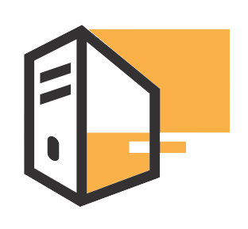

         

<h1 align="center">FileBox 
    
    
    
    
</h1>  

## Docker

If you want to use plain docker, you can build the docker image with `docker built -t filebox .`
and run a container with `docker run -d -p 4200:4200 filebox:latest`.
This will run a container of filebox in detached mode, so it keeps running after you close the Terminal. To remove the container, run `docker kill <container_name>`. You can find the container name by running `docker ps | grep filebox | awk 'OFS="\t" {print $11}'`, if you haven't specified your own container name.

### Docker Compose

You can also use the provided docker-compose.yml to simplify the dockerization process. Just run `docker-compose up -d`, and you're done.
This will also run in detached mode, but you can kill it the same way like a normal container.

## Development server

Run `ng serve` for a dev server. Navigate to `http://localhost:4200/`. The app will automatically reload if you change any of the source files.

## Code scaffolding

Run `ng generate component component-name` to generate a new component. You can also use `ng generate directive|pipe|service|class|guard|interface|enum|module`.

## Build

Run `ng build` to build the project. The build artifacts will be stored in the `dist/` directory. Use the `--prod` flag for a production build.

## Running unit tests

Run `ng test` to execute the unit tests via [Karma](https://karma-runner.github.io).

## Running end-to-end tests

Run `ng e2e` to execute the end-to-end tests via [Protractor](http://www.protractortest.org/).

## Further help

To get more help on the Angular CLI use `ng help` or go check out the [Angular CLI Overview and Command Reference](https://angular.io/cli) page.
